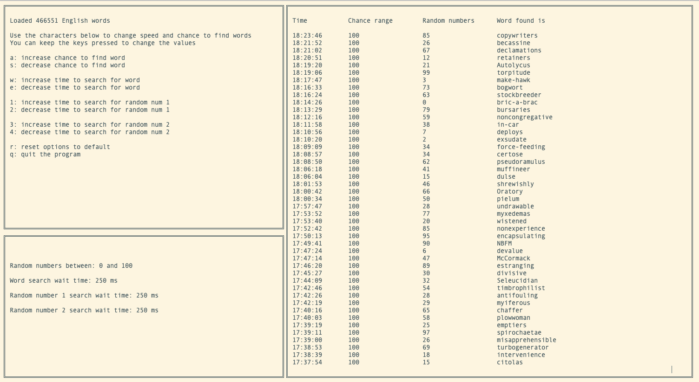

# Disclaimer: This is just for fun and **not** a real ghostbox.

## Ghostbox/Ovilus
I am learning the Rust programming language and needed a project to do.\
I enjoy watching the GhostAdventures. So, I thought it would be fun to make an Ovilus.

## Code
I'm still learning Rust so there might be a lot of inefficient code.\
Or maybe that I should use other methods/crates etc.
I still need to write test for the code and I need to add better comments/documentation.\
My **first priority** was to get better with Rust.

## How it works
I don't know how a real Ghostbox/Ovilus algorithm works or looks like.\
So I made it very simple.

1. The program contains a file with English words.\
I generate a random number between 0 and number of English words (more than 450 thousand)
2. I generate two other random numbers.\
Default between 0 and 100.
3. First it gets time to generate a number for the word.\
Then time for both of the other random numbers.\
After that it check if both numbers are equal.\
If they are equal then a word is found.

## How it looks
It's a terminal application.

## What can you do with it?
You have some options when you run the program.
- increase/decrease **chance to find word**\
If you increase the chance to much (lowest is between 0 and 10) it will find words very often.\
You shouldn't use a to low value.\
It's better when the chance to find two equally random numbers is very low.
- increase/decrease **time to search for word**\
Give the ghost more or less time to search a word (in milliseconds)
- increase/decrease **time to search for random number one**\
Give the ghost more or less time to find a number (in milliseconds)
- increase/decrease **time to search for random number two**\
Give the ghost more or less time to find the same number (in milliseconds)
- after you have changed the options to **reset options to default**
- and ofcourse **quit the program**

## Results
Although this is just all for **fun**, I had a weird experience.\
I asked 'Do you know what my name is'.\
Then within 2 or 3 seconds I got the response 'Richardia'. According to Google that's a flower.\
In case you (the reader) didn't know, my name is Richard.\
I should buy a lottery ticket, maybe I am lucky enough with that too :)

But I **don't** believe it was supernatural, just dumb luck.\
Because after that response nothing seemed to make sense with the responses and my questions.

## Used resources
[Crossterm](https://github.com/TimonPost/crossterm)\
[Rand](https://github.com/rust-random/rand)\
[Chrono](https://github.com/chronotope/chrono)\
[List with English words](https://github.com/dwyl/english-words)
